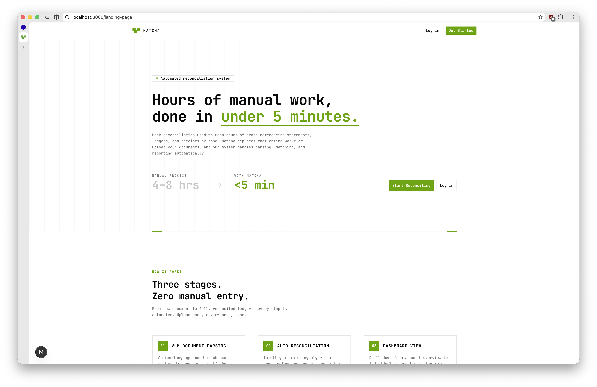
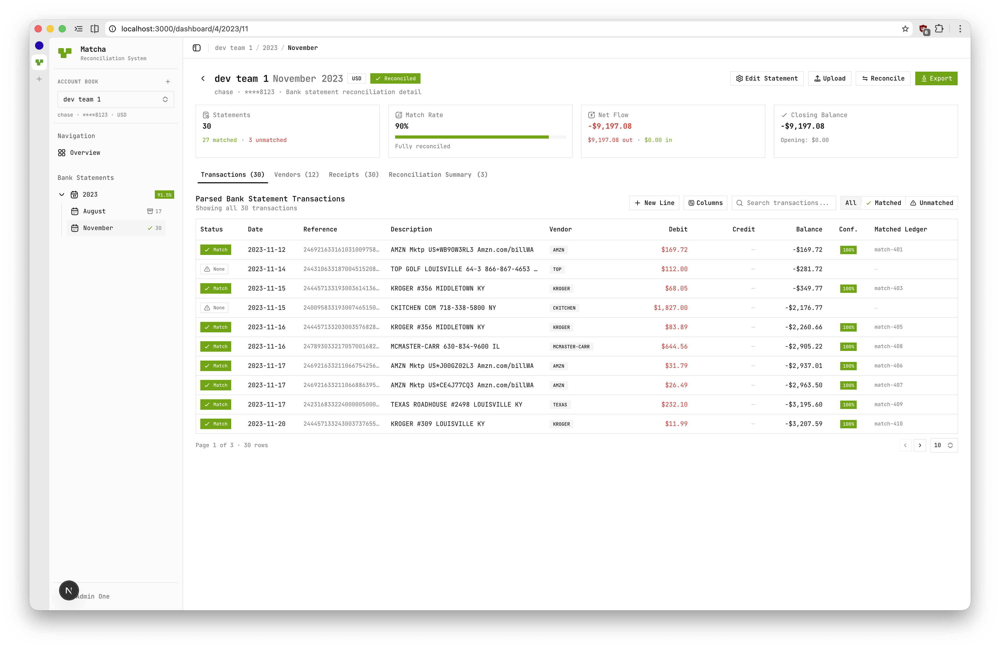
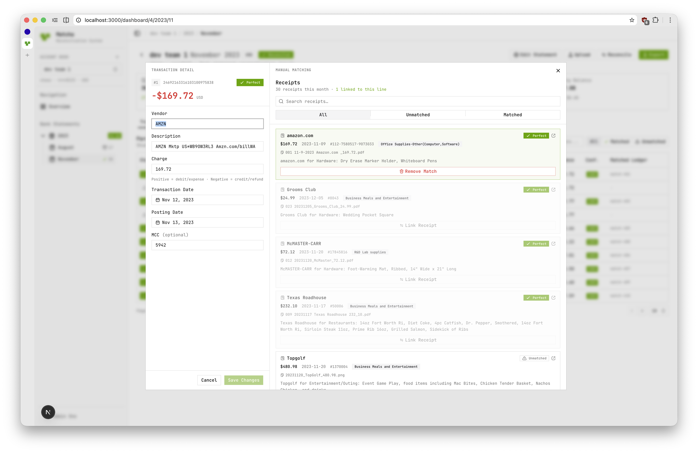
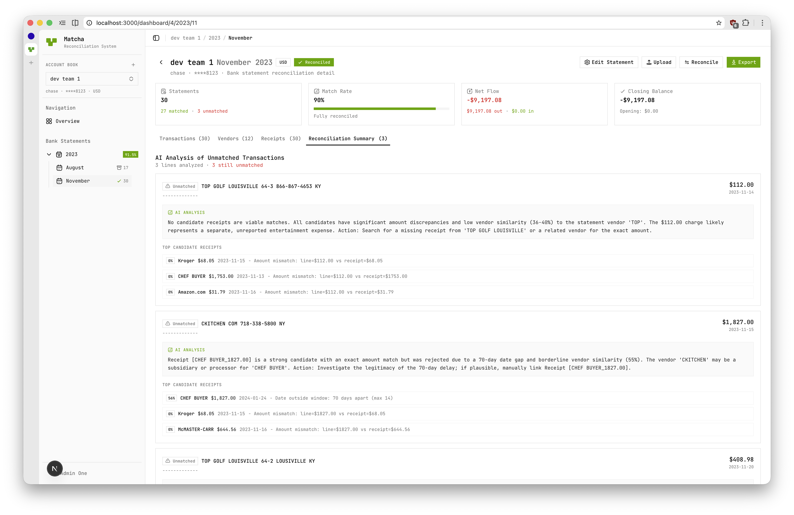
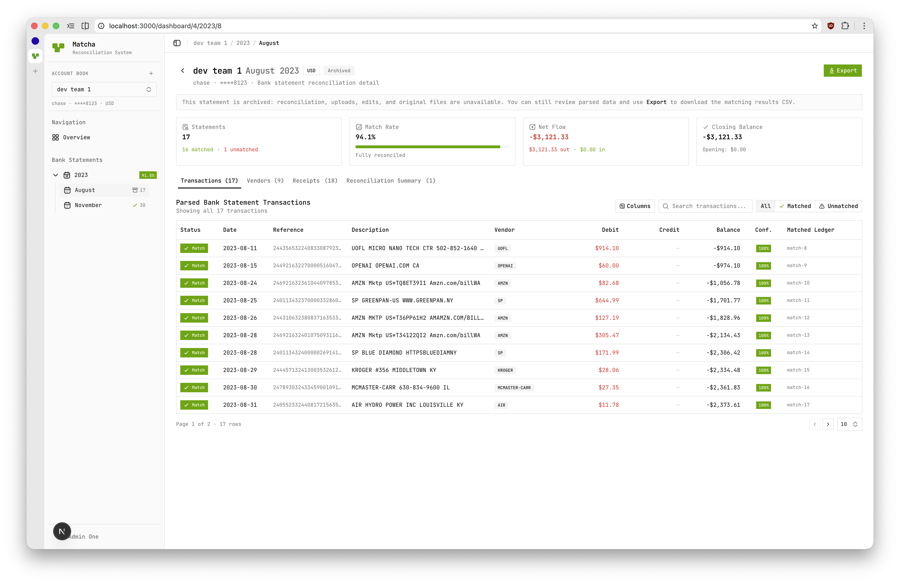
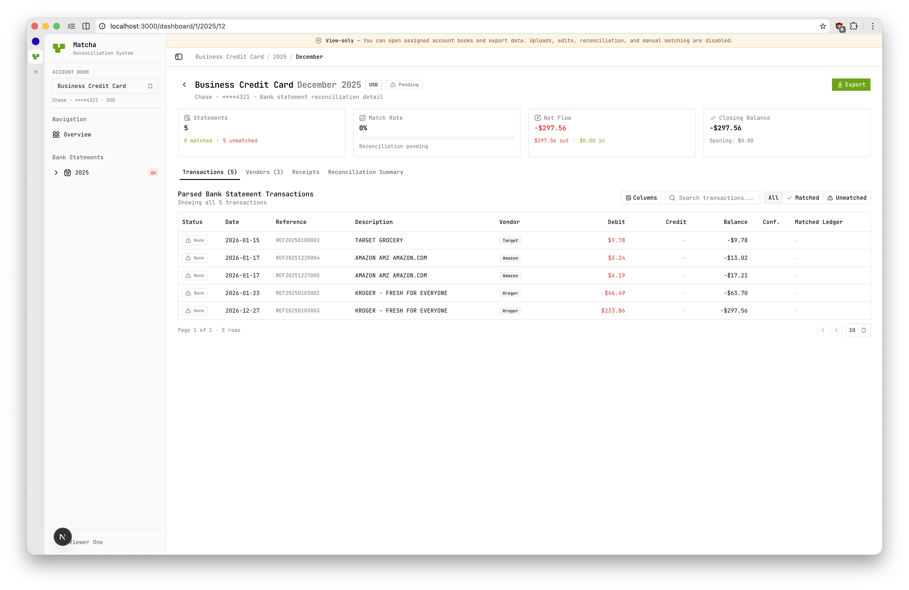
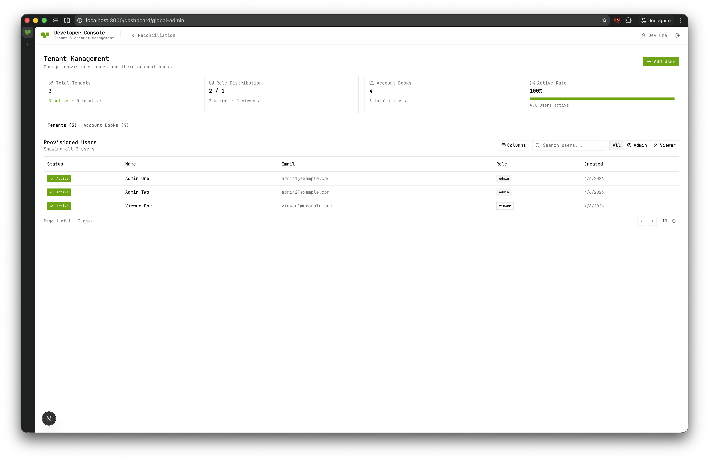

# Matcha UI Specification Report

> AI-Assisted Bank Statement Reconciliation System

---

## 1. Project Overview

Matcha is an AI-assisted bank statement reconciliation system. The frontend is a Next.js application that provides authentication, a public landing page, and a dashboard for managing account books, viewing transaction summaries, and tracking reconciliation status.

### Architecture

- **Backend**: FastAPI (Python 3.13+) with PostgreSQL, AWS S3, SQS, and Bedrock
- **Frontend**: Next.js 16 (App Router) with TypeScript, Tailwind CSS v4, and shadcn/ui

---

## 2. Tech Stack

| Layer | Technology |
|-------|------------|
| Framework | Next.js 16.1.6 (App Router, RSC) |
| Language | TypeScript 5 (strict) |
| UI Library | React 19.2.3 |
| Styling | Tailwind CSS v4 |
| Components | shadcn/ui (radix-lyra style) + Radix UI primitives |
| Icons | Hugeicons (`@hugeicons/react`) |
| Charts | Recharts |
| Tables | TanStack React Table (`DataTable` component) |
| Data Fetching | TanStack React Query |
| Font | JetBrains Mono |

---

## 3. Route Map

| Route | Type | Description |
|-------|------|-------------|
| `/` | Server | Redirects to `/landing-page` |
| `/landing-page` | Server | Public marketing page (Modal.com-inspired) |
| `/auth/login` | Client | Login form (email + password) |
| `/auth/signup` | Server | WIP notice — registration closed |
| `/dashboard` | Client | Redirects to first account or global-admin |
| `/dashboard/global-admin` | Client | Developer tenant management |
| `/dashboard/[accountId]` | Client | Account-level dashboard |
| `/dashboard/[accountId]/[year]` | Client | Year-level dashboard |
| `/dashboard/[accountId]/[year]/[month]` | Client | Month-level dashboard (transactions) |

---

## 4. Navigation Pattern

The dashboard uses a **URL-driven drill-down** pattern:

1. **Account level** → Overview of all years
2. **Year level** → Monthly breakdown
3. **Month level** → Transaction table with reconciliation stats

Navigation state is tracked in the URL (e.g., `/dashboard/1/2024/3`). The sidebar (`AppSidebar`) renders an account selector and collapsible year/month tree.

---

## 5. Key UI Components

| Component | Purpose |
|-----------|---------|
| `AppSidebar` | Main navigation with account/year/month tree |
| `DashboardAccount` | Account-level overview |
| `DashboardYear` | Year-level monthly breakdown |
| `DashboardMonth` | Transaction table + AI reconciliation summary tab |
| `DataTable` | Generic sortable/filterable/paginated table |
| `UploadDialog` | Drag-and-drop file upload (statements/receipts) |
| `JobStatusFloat` | Floating widget showing parsing/reconciliation job progress |
| `ViewerModeBanner` | Amber read-only reminder for viewer-role users |
| `DeveloperConsoleShell` | Minimal shell for global-admin route |
| `DeveloperGlobalAdminPanel` | Tenants + account books management panel |

---

## 6. Authentication Flow

- **Cookie-based** — HttpOnly JWT cookie + readable `csrf_token` cookie
- **CSRF Protection** — Double Submit Cookie pattern (`X-CSRF-Token` header)
- **Route Guard** — Next.js Edge middleware checks `csrf_token` on `/dashboard/*`
- **No client-side token storage** — JWT is never in localStorage or React state

### Login Flow

| Step | Description |
|------|-------------|
| Login | `POST /auth/login` — backend sets HttpOnly JWT cookie + `csrf_token` cookie |
| Session Detection | `AuthProvider` checks `csrf_token` cookie, calls `GET /auth/me` |
| Authenticated Requests | All fetch calls use `credentials: "include"` |
| CSRF | Mutating requests include `X-CSRF-Token` header |
| Logout | `POST /auth/logout` — backend clears cookies |
| 401 Handling | Global callback clears auth state on unauthorized |

---

## 7. User Roles & Permissions

| Role | Capabilities |
|------|-------------|
| `admin` | Full access: upload, edit, reconcile, manage accounts |
| `developer` | Admin access + tenant management (`/dashboard/global-admin`) |
| `viewer` | Read-only: browsing and export only; sees `ViewerModeBanner` |

### Permission Helpers

- `isViewerRole()` — Checks if user is viewer
- `canMutateData()` — Checks if user can perform write operations
- `canCreateAccountBook()` — Checks if user can create new account books

---

## 8. Data Flow Architecture

```
Backend (FastAPI)
    ↓
lib/api.ts (fetch wrappers with cookie/CSRF handling)
    ↓
React Query hooks (hooks/use-*.ts)
    ↓
Transforms (lib/transforms.ts) — snake_case → camelCase
    ↓
View Types (lib/domain-types.ts)
    ↓
UI Components
```

### Type Layers

| Layer | File | Format |
|-------|------|--------|
| API Types | `lib/types.ts` | snake_case (matches backend Pydantic) |
| View Types | `lib/domain-types.ts` | camelCase (used by components) |
| Transforms | `lib/transforms.ts` | Pure functions: API → View |

---

## 9. Connected Backend Endpoints

| Tier | Endpoints | Frontend Hooks |
|------|-----------|----------------|
| **Auth** | `/auth/login`, `/auth/me`, `/auth/logout` | `useAuth()` |
| **Upload** | `/documents/upload-url`, `/documents/{id}/confirm-upload` | `useTrackedDocumentUpload()` |
| **Documents** | `GET/DELETE /documents` | `useDocuments()`, `useDeleteDocument()` |
| **Jobs** | `GET /jobs/{id}/status` | `useJobStatus()` (polls every 3s) |
| **Reconciliation** | `/reconciliation/start`, `/reconciliation/ai-summary` | `useStartReconciliation()`, `useReconciliationAISummary()` |
| **Receipts** | `GET/PATCH /receipts` | `useReceipts()`, `useUpdateReceipt()` |
| **Statements** | `GET /statements`, `GET /statements/{id}/lines`, `PATCH /statements/{id}/lines/{lineId}` | `useStatements()`, `useStatementLines()`, `useUpdateStatementLine()` |
| **Accounts** | `POST/GET/PATCH/DELETE /accounts` | `useAccounts()`, `useCreateAccount()`, etc. |
| **Members** | `GET/POST/DELETE /accounts/{id}/members` | `useAccountMembers()`, `useAddAccountMember()`, etc. |
| **Admin Users** | `GET/POST/PATCH/DELETE /admin/users` | `useAdminUsers()`, `useCreateAdminUser()`, etc. |

---

## 10. Design System

### Color Tokens

Semantic CSS custom properties defined in `app/globals.css`:

- `--background`, `--foreground`
- `--primary`, `--secondary`
- `--muted`, `--accent`
- `--destructive`
- `--card`, `--popover`
- `--sidebar-*`
- `--chart-1` through `--chart-5`

### Styling Rules

- Use Tailwind utility classes only (no CSS modules or styled-components)
- Use `cn()` helper for conditional class merging
- Use semantic color tokens (e.g., `text-foreground`, `bg-primary`)
- Dark mode via `prefers-color-scheme` and `.dark` class
- Accent color: Matcha green

### Icons

- Library: Hugeicons (`@hugeicons/core-free-icons`)
- Render with `<HugeiconsIcon icon={...} size={...} />`

---

## 11. Domain Concepts

| Concept | Description |
|---------|-------------|
| **Account Book** | Bank account with metadata (name, bank, currency, etc.) |
| **Bank Statement** | Parsed statement for a specific account/month/year |
| **Statement Line** | Single transaction line within a statement |
| **Receipt** | AI-parsed receipt linked to a document |
| **Document** | Uploaded file tracked through processing stages |
| **Match Status** | `unmatched`, `perfect_matched`, `bundle_matched`, `manual` |
| **Reconciliation** | Process of matching statement lines to receipts |
| **AI Summary** | AI-generated analysis of unmatched lines |
| **Selection** | Navigation state (account, year, month, drill level) |

---

## 12. Document Lifecycle

```
Upload → pending_upload → pending_processing → processing → parsed/failed
```

1. User requests presigned upload URL
2. User uploads file to S3
3. User confirms upload → creates parsing Job, enqueues SQS
4. Worker downloads from S3, runs Bedrock/pdfplumber parsing
5. Writes `Receipt` or `BankStatement` + lines
6. Document status set to `parsed` or `failed`

---

## 13. Reconciliation Workflow

1. User starts reconciliation via `POST /reconciliation/start`
2. API creates reconciliation job, enqueues `run_reconciliation` on SQS
3. Worker runs matching algorithm + optional AI line summaries
4. UI polls `GET /jobs/{job_id}/status` for progress
5. Results available via reconciliation endpoints
6. AI summary tab shows analysis of unmatched lines

---

## 14. Statement Archival

- Statements auto-archived after configurable retention period (default: 18 months)
- Archival is **irreversible** and server-side enforced
- Archived statements:
  - S3 objects deleted
  - Structured data remains in PostgreSQL
  - PATCH returns 403
  - Cannot start reconciliation
  - File URLs return 410 Gone


## 15. UI Screenshots

### Landing Page


### Admin Dashboard


### Edit Statement Dialog


### Reconciliation Summary


### Statement Archival 


### Viewer Dashboard


### Global Admin Dashboard

