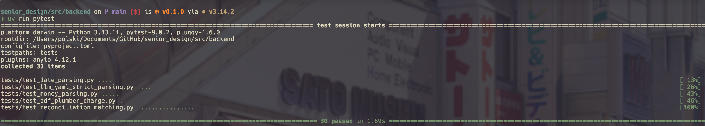
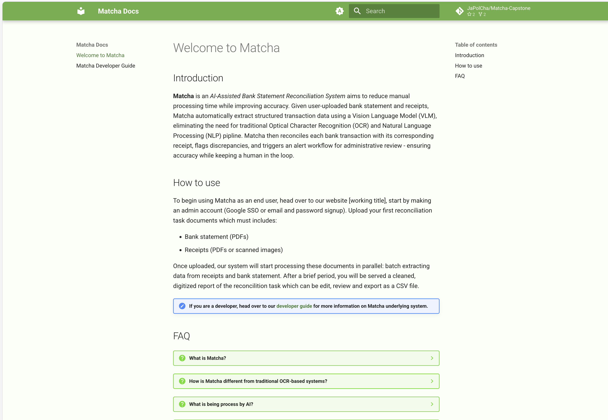

# 2025-2026 UC Computer Science Senior Capstone

```

     ^^
 ^^         ^^                ^^                         ^^
       ^^         ^^                                                          ^^
   ^^    ^^                           ^^
             ^^                                   ^^             ^^
                 _
               _(_)_                          wWWWw   _
   @@@@       (_)@(_)   vVVVv     _     @@@@  (___) _(_)_
  @@()@@ wWWWw  (_)\    (___)   _(_)_  @@()@@   Y  (_)@(_)          ^^     ^^
   @@@@  (___)     `|/    Y    (_)@(_)  @@@@   \|/   (_)\              ^^^
    /      Y       \|    \|/    /(_)    \|      |/      |     ^^^^^    \|/     ^^^^
 \ |     \ |/       | / \ | /  \|/       |/    \|      \|/   \\\|//  \\\|//    \||/
 \\|//   \\|///  \\\|//\\\|/// \|///  \\\|//  \\|//  \\\|//  \\\|//  \\\|//  \\\|//
^^^^^^^^^^^^^^^^^^^^^^^^^^^^^^^^^^^^^^^^^^^^^^^^^^^^^^^^^^^^^^^^^^^^^^^^^^^^^^^^^^^

```
## Table of Contents 
1. [Project Description](#project-description) **(updated to include 400-character abstract and should reflect final version of the project)**
2. [User Interface Specification](https://github.com/chaung844/senior_design/blob/main/Documents/matcha_ui_specifications.md)
3. [Test Plan and Results](#test-plan-and-results)
4. [Matcha Docs Page](#matcha-docs-page)
5. [Link to Spring final presentation](https://docs.google.com/presentation/d/1sw_oC3WZhbq-6qRZyEqjGtKMVnaSyBNfV1IztxLbw5U/edit?slide=id.g3bee7031db0_0_0#slide=id.g3bee7031db0_0_0)
6. [Link to the final EXPO poster](https://github.com/chaung844/senior_design/blob/main/Documents/tran2tp_EXPO.pdf)
7. [Assessments](#assessments) - **UPDATE FOR INDIVIDUAL ASSESSMENT (DONT PUT THE TEAM ASSESSMENT IN)**
8. [Summary of Hours and Justification](#summary-of-hours-and-justification) **(one per individual team member)**
9. [Budget](./Documents/budget.md) - **REVIEW AND UPDATE for AWS SERVICES (S3, Bedrock, SQS) COST: ~50$ sponsored by Midea**
10. [Appendix](#appendix)

## Project Description

### Team JaPolCha
```
     .-./`)     ____    .-------.     ,-----.      .---.        _______   .---.  .---.    ____     
     \ '_ .') .'  __ `. \  _(`)_ \  .'  .-,  '.    | ,_|       /   __  \  |   |  |_ _|  .'  __ `.  
    (_ (_) _)/   '  \  \| (_ o._)| / ,-.|  \ _ \ ,-./  )      | ,_/  \__) |   |  ( ' ) /   '  \  \ 
      / .  \ |___|  /  ||  (_,_) /;  \  '_ /  | :\  '_ '`)  ,-./  )       |   '-(_{;}_)|___|  /  | 
 ___  |-'`|     _.-`   ||   '-.-' |  _`,/ \ _/  | > (_)  )  \  '_ '`)     |      (_,_)    _.-`   | 
|   | |   '  .'   _    ||   |     : (  '\_/ \   ;(  .  .-'   > (_)  )  __ | _ _--.   | .'   _    | 
|   `-'  /   |  _( )_  ||   |      \ `"/  \  ) /  `-'`-'|___(  .  .-'_/  )|( ' ) |   | |  _( )_  | 
 \      /    \ (_ o _) //   )       '. \_/``".'    |        \`-'`-'     / (_{;}_)|   | \ (_ o _) / 
  `-..-'      '.(_,_).' `---'         '-----'      `--------`  `._____.'  '(_,_) '---'  '.(_,_).'  
                                                                                                                                                                                 
```

- [Chau Nguyen](https://github.com/chaung844) - Computer Science Senior - nguye2cu@mail.uc.edu
- [Tiep Tran](https://github.com/polskiTran) - Computer Science Senior - tran2tp@mail.uc.edu
- [Jack Nguyen](https://github.com/Jack51003) - Computer Science Senior - nguye2lo@mail.uc.edu

### Advisor
- Ryan Persaud - Project Leader at Midea - ryan.persaud@midea.com

### Project Abstract
- Project Name: Matcha
- Midea sponsored project: A system to automate the matching process for bank statements along with receipts. **UPDATE THIS**

## Test Plan and Results
[Test plan](https://github.com/chaung844/senior_design/blob/main/Documents/Matcha_Capstone_Test_Plan.pdf)

Results:


## Matcha Docs Page
[Matcha dev/user doc page](https://chaung844.github.io/senior_design/)


## Assessments

### Tiep Tran's assessments
- [Initial assessment](https://github.com/chaung844/senior_design/blob/main/Documents/Capstone_Assessments/Fall2025_assessments/TiepTran_capstone_assessment.md)
- [Final assessment](https://github.com/chaung844/senior_design/blob/main/Documents/Capstone_Assessments/Spring2026_assessments/TiepTran_final_self_assessment.md)

### Chau Nguyen's assessments
- [Initial assessment](https://github.com/chaung844/senior_design/blob/main/Documents/Capstone_Assessments/Fall2025_assessments/ChauNguyen_capstone_assessment.md)
- [Final assessment](https://github.com/chaung844/senior_design/blob/main/Documents/Capstone_Assessments/Spring2026_assessments/ChauNguyen_final_self_assessment.md)

### Jack Nguyen's assessments
- [Initial assessment](https://github.com/chaung844/senior_design/blob/main/Documents/Capstone_Assessments/Fall2025_assessments/JackNguyen_capstone_assessment.md)
- [Final assessment](https://github.com/chaung844/senior_design/blob/main/Documents/Capstone_Assessments/Spring2026_assessments/JackNguyen_final_self_assessment.md)

## Summary of Hours and Justification

[Tiep Tran hours and justification](https://github.com/chaung844/senior_design/blob/main/Documents/Individual_Hours_Justification/TiepTran_hours.md)
[Chau Nguyen hours and justification](https://github.com/chaung844/senior_design/blob/main/Documents/Individual_Hours_Justification/ChauNguyen_hours.md)
[Jack Nguyen hours and justification](https://github.com/chaung844/senior_design/blob/main/Documents/Individual_Hours_Justification/JackNguyen_hours.md)

> In-person team meeting (major task blocks, update, assignment) occurs weekly after Senior Design class. Online disucssion and small task update occurs regularly thorughout the week via Discord. 

## Appendix

- [Code repo](https://github.com/chaung844/senior_design)
- [Midea project proposal slides](https://mailuc-my.sharepoint.com/:p:/g/personal/tran2tp_mail_uc_edu/Eco2b7lw3Q9Ntb0eswqJq_UBNOusbNZco1s2Mnr52X-n2A?e=bap2SZ)
- [Link to team planner used for task assignment and project tracking](https://github.com/users/chaung844/projects/1/views/3)
